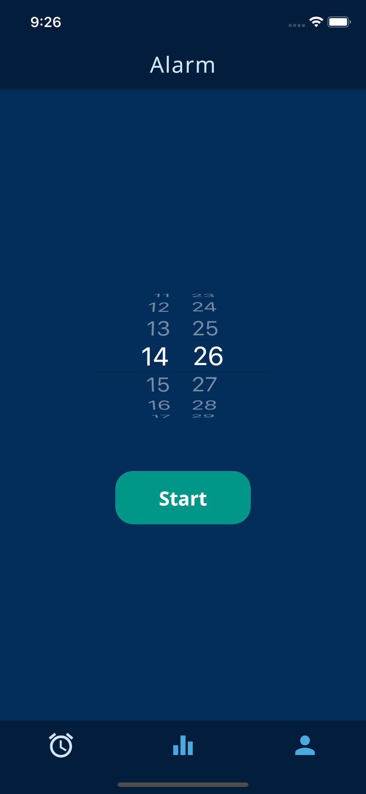
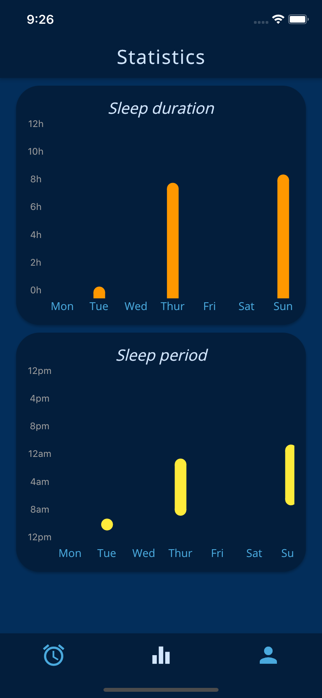
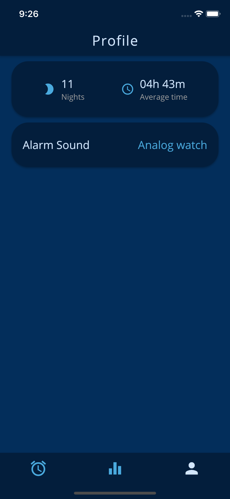
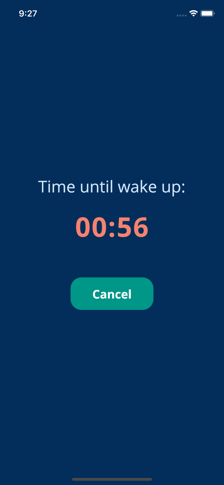
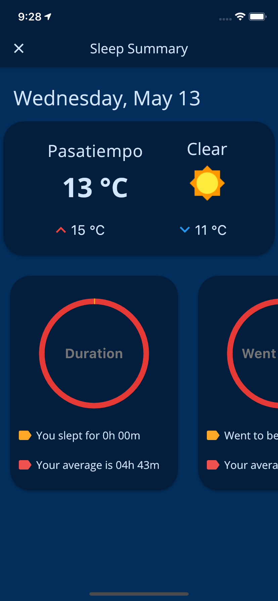
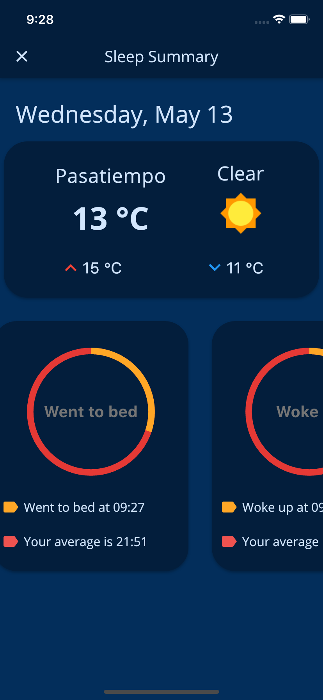

# Sleep Organized

A sleep-tracker app built using Flutter. The duration and time period of each sleep is stored locally and can be later used for statistics.

## Screenshots

| Alarm | Statistics | Profile |
|:----:|:----:|:----:|
| |  |  |

| Sleeping | Wake up 1 | wake up 2 |
|:----:|:----:|:----:|
| |  |  |
